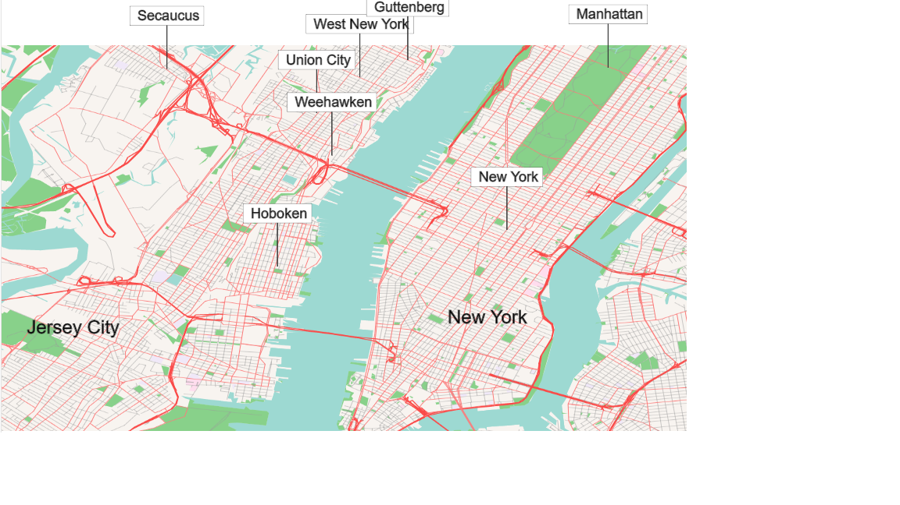

<h1>Ol3 + Mapzen’s vector tile </h1>      
The company Mapzen offers the coverage of OpenStreetMap base layer data as vector tiles (<a href="https://mapzen.com/projects/vector-tiles/">https://mapzen.com/projects/vector-tiles/</a>) . 
In its website I saw some examples with Mapbox and d3.js but not with ol3. Ol3 is widespread used 
and and often used with raster OSM Tile. I wanted to test how Mapzen’s Tile Vectors work with ol3…

Test on Chrome, FF and Ms-Edge
Next step: Ol3 can read also topojson, it will be nice to use it sas as alternative to geojson.

    <a href="https://cdn.rawgit.com/pafavero/map-vector-tile/master/index.html" target="_blank" >Show preview</a>

  

